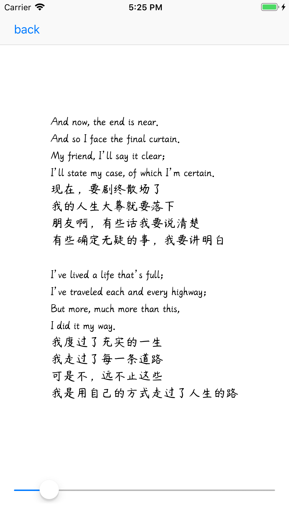

# IdeaCheck

一些做项目时的idea的验证工程

### 1.美文系列

使用多种低占用的字体构建的阅读应用，最求文字之美。

### 2.IconFont的应用

减小包存储空间，灵活附色。比较适合对包大小敏感的项目。

### 3.Pop Animation等其他动画 (未完待续)
facebook等一些开源动画的常识使用

### 4.荧光系列
一些荧光效果，比较适合暗背景App，加一些装点效果。其中有静态荧光(辉光)、动态荧光(辉光)

